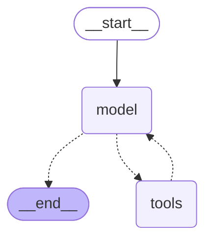

# Live Flight Price Prediction

ML pipeline that predicts US domestic flight prices, built on the [dilwong/flightprices](https://www.kaggle.com/datasets/dilwong/flightprices) Kaggle dataset (Expedia scrape, ~82M rows / ~30GB uncompressed).

**Live demo:** [live-flight-price-prediction.streamlit.app](https://live-flight-price-prediction-fyfufgjba73fga3fdddczv.streamlit.app/) — pick a route and date, get a real buy/wait recommendation from the agent (Layer 2 below). Prediction API alone: `https://flight-price-api-j1sh.onrender.com/predict` (see [Deployment](#deployment)).

## Dataset

- **Full raw data**: `itineraries.csv`, ~82.1M rows, 27 columns, one row per itinerary returned by a price search.
- **Date range**: `searchDate` 2022-04-16 to 2022-10-05, `flightDate` 2022-04-17 to 2022-11-19 (~7 months, single year — this is a real limitation, see caveat below).
- **Why this dataset**: it has separate `searchDate` and `flightDate` columns, which is what makes an honest `daysUntilDeparture` (advance-booking) feature possible. It's large and real rather than synthetic, and avoids the fragility/cost of live scraping for a reproducible portfolio piece.
- **Sample used for modeling**: `flight_sample.csv`, 1.5M rows, built by filtering the full dataset down to the 10 city-pairs (20 directed routes) with the highest combined bidirectional traffic, then randomly downsampling to 1.5M rows. Regenerate it with `uv run scripts/build_sample.py` (requires `itineraries.csv` in the project root — not committed to git, 31GB).
- **The 20 routes**: ATL, LAX, LGA, BOS, JFK, DFW, ORD, DTW, EWR, CLT — see `airport_reference.md` for the full code→airport-name mapping and the route list. Note 9 of the 10 city-pairs include LAX, since LAX is the single highest-traffic airport in this dataset; this was a deliberate tradeoff (real hub traffic) over forcing artificial route diversity.
- **Known limitation**: since the data spans one continuous ~7-month window, we can't separate genuine recurring yearly seasonality from a one-off trend over this specific observation period, and there's no winter holiday data (Christmas/New Year) at all.

## EDA → Feature Engineering

Every feature below was only kept because exploratory analysis (`notebooks/02_price_exploration.ipynb`, `notebooks/03_route_layover_price.ipynb`) showed real evidence it relates to price — nothing was included on intuition alone, and known false leads are documented too.

### Target variable

`totalFare` (what the customer actually pays, tax/fees included) — not `baseFare`.

### Final feature set (10 features)

| Feature | Derived from | Evidence for inclusion |
|---|---|---|
| `daysUntilDeparture` | `flightDate - searchDate` | Correlation is near-zero (-0.05) but that's because the relationship is **non-linear**, not because it's absent — average price traced against days-until-departure shows a real curved shape (a low point around day 45). Linear correlation is the wrong tool for this pattern; tree-based models can still split on it effectively. |
| `flightDayOfWeek` | `flightDate` | Clear, consistent day-of-week variation — Tuesday is the cheapest day to fly across the sample. |
| `flightMonth` | `flightDate` | Strongest seasonality signal found: average price swings from $462 (June, peak) to $253 (November, trough) — a 45% drop. |
| `departureHour` | first leg of `segmentsDepartureTimeRaw` | Linear correlation is near-zero (-0.008), but the raw hour-by-hour breakdown shows a real $142 spread — midnight ($469) and 10-11pm ($395-416) departures are notably pricier than the rest of the day ($327-373). A naive quarter-of-day bucketing hid this pattern entirely; only checking the raw hourly numbers revealed it. |
| `startingAirport`, `destinationAirport` | as-is | Route-level price variation is large and consistent; also participates in a real route × stops interaction (see `numStops`). |
| `numStops` | count of `\|\|`-separated segments in `segmentsAirlineCode` | Pooling all routes together showed "more stops = pricier" ($327/$375/$434/$520 for 0/1/2/3 stops) — but breaking this down **per route** reversed the story for about half the routes (classic Simpson's paradox: pooled data hid a route-dependent effect). On long transcontinental LAX routes (e.g. LAX-BOS), 1-stop is the cheapest option, saving up to $76 vs nonstop. On shorter regional routes (e.g. DFW-LAX), nonstop is cheapest and each added stop costs more. 2-stop is almost always the most expensive tier once there's enough data to trust it. Kept as a feature specifically so a tree model can learn the route × stops interaction rather than a single global rule. |
| `primaryAirline` | first leg of `segmentsAirlineName` | $229 spread between the cheapest reliable carrier (Spirit, $234) and priciest (Alaska, $463), backed by tens-to-hundreds-of-thousands of rows per carrier. Tiny regional carriers (under ~130 rows each) excluded from this evidence as unreliable. |
| `totalTravelDistance` | as-is | Correlation of 0.36 — the strongest single linear correlation with price found in this dataset. ~10% missing values need to be handled (see below). |
| `isBasicEconomy` | as-is (boolean) | Largest single price gap found: $386 (non-basic) vs $210 (basic economy), a $176 difference. Strongest signal in the whole feature set. |

### Columns excluded, and why (every raw column accounted for)

Raw data has 27 columns total. Every one is accounted for below — nothing was silently dropped.

**Group A — consumed to derive a kept feature, then not needed in raw form:**
`searchDate`, `flightDate` (→ `daysUntilDeparture`, `flightDayOfWeek`, `flightMonth`), `segmentsDepartureTimeRaw` / `segmentsDepartureTimeEpochSeconds` (→ `departureHour`), `segmentsAirlineName` (→ `primaryAirline`), `segmentsAirlineCode` (→ `numStops`), `segmentsArrivalAirportCode` / `segmentsDepartureAirportCode` (used to reason about layovers during EDA).

**Group B — tested with EDA, explicitly excluded for no/weak signal:**
| Column | Reason |
|---|---|
| `searchDayOfWeek` (derived) | Tested directly against price — no meaningful effect, unlike `flightDayOfWeek`. |
| `travelDuration` | Weak correlation (0.18), largely redundant with `totalTravelDistance` and `numStops`. |
| `isRefundable` | Effectively constant: only 1,332 of 82,138,753 rows (0.0016%) are `True` in the full dataset. A column with almost no variance carries no learnable signal. |
| `isNonStop` | Redundant — identical information to `numStops == 0`. |
| `seatsRemaining` | Correlation of only 0.068. Turned out to be a capped/truncated field (values only ever range 0-10, even though real aircraft carry 100+ passengers) — a display artifact of the booking system, not a true inventory count, which explains the negligible signal. |

**Group C — never tested, excluded for now (candidates for future work, not ruled out on evidence):**
`fareBasisCode` (airline internal fare code, likely high-cardinality/noisy), `elapsedDays`, `segmentsArrivalTimeRaw` / `segmentsArrivalTimeEpochSeconds` (only departure time was tested), `segmentsEquipmentDescription` (plane model, messy free text), `segmentsDurationInSeconds` (per-leg duration, redundant with total duration which is already excluded), `segmentsDistance` (per-leg distance — not a feature itself, but usable to impute the missing 10% of `totalTravelDistance`), `segmentsCabinCode` (cabin class, likely almost entirely "coach" in this economy-dominated data).

**Group D — always excluded, independent of signal strength:**
| Column | Reason |
|---|---|
| `legId` | Row identifier, no predictive meaning. |
| `baseFare` | **Data leakage risk.** `totalFare = baseFare + taxes/fees`, so `baseFare` is almost perfectly correlated with the target. Including it would let the model learn a trivial arithmetic shortcut instead of real patterns from dates, routes, and airlines. |

## Model training & evaluation

**Chronological split, not random** — 65% train / 20% validation / 15% test, split by `flightDate` (train: Apr 17-Sep 3, validation: Sep 4-Oct 2, test: Oct 3-Nov 19 2022), not a random shuffle. A random split would let the model train on rows from later dates while being tested on earlier ones, implicitly leaking future information across the split — a real risk given `flightMonth` is one of the strongest features.

**Three models compared, same split, same features, one-hot encoded categoricals:**

| Model | Val MAE | Val RMSE | Val R² | Test MAE | Test RMSE | Test R² |
|---|---|---|---|---|---|---|
| Random Forest | $80.09 | $120.59 | 0.2521 | $94.92 | $139.55 | 0.0981 |
| **XGBoost** | **$77.38** | **$108.15** | **0.3985** | $103.02 | **$137.40** | **0.1256** |
| LightGBM | $79.81 | $111.17 | 0.3644 | $105.69 | $139.52 | 0.0984 |

**XGBoost wins** on RMSE and R² both validation and test (Random Forest edges it out on test MAE specifically, but by a smaller margin than XGBoost's advantage on the other two metrics). All test scores drop noticeably from validation — expected, since the test period (Oct-Nov) is the cheapest, least-represented part of the year in training.

**A tuning experiment worth documenting:** increasing XGBoost to 500 trees/depth 8 (from 300/depth 6) looked promising at first (would need to be tested against validation to know), but checking train-vs-validation R² revealed real overfitting (train R² 0.68 vs validation R² 0.36 - gap 0.32, versus 0.59/0.40 - gap 0.19 for the smaller model). The original, smaller hyperparameters were kept.

**SHAP interpretability** (`scripts/shap_analysis.py`, run on the validation set) confirms the model relies on `totalTravelDistance`, `flightMonth` (September specifically pushes price down, matching EDA), and `isBasicEconomy` as the top 3 signals by a wide margin — consistent with what EDA independently found, which is the actual point of running this check: confirming the model learned real patterns rather than something spurious. One real pitfall was caught and fixed during this analysis: explaining a sparse-trained XGBoost model with a densely-converted input array produced an implausible result (single feature contributing $541 on average, more than the dataset's mean price) — traced to XGBoost treating implicit sparse zeros as "missing" during training but literal zeros once densified for SHAP. Fixed by keeping the encoder dense throughout, both training and explanation.

## Deployment

Final model retrained on train+validation combined, saved as `model_artifact.joblib`, served via a small FastAPI app (`api/main.py`) with one `/predict` endpoint.

**Deployed on Render, not AWS SageMaker** — a deliberate choice, not a default. SageMaker's real-time endpoints bill hourly for the underlying instance regardless of traffic, and a prior unrelated project run up an unexpected $1500 bill this way. Render's free tier has a hard cap (spins down when idle, no idle billing), which avoids that failure mode entirely for a portfolio project's traffic level.

**Live API:** `https://flight-price-api-j1sh.onrender.com`

```bash
curl -X POST https://flight-price-api-j1sh.onrender.com/predict \
  -H "Content-Type: application/json" \
  -d '{
    "startingAirport": "LAX", "destinationAirport": "BOS",
    "primaryAirline": "Delta", "flightDayOfWeek": 4, "flightMonth": 9,
    "departureHour": 8, "numStops": 0, "totalTravelDistance": 2611,
    "daysUntilDeparture": 35, "isBasicEconomy": false
  }'
# -> {"predictedFare": 395.16}
```

Note: free tier spins down after 15 minutes idle; the first request after that takes ~30-50s to wake up.

## Layer 2: LangGraph buy/wait agent

**Live price data:** `agent/tools.py`'s `get_current_price` calls SerpAPI's `google_flights` engine — the same data a real user would see searching Google Flights, not a generic web scrape. Verified once against a manual Delta.com search early on; the automated results matched exactly ($439/$549/$689 for the same three flights).

**The day-by-day trend tool changed shape from the original plan.** The original idea (`get_price_trend(days=7)`, forecasting whether waiting N more days lowers the price for a *fixed* flight) was tested and rejected: the model's predicted price barely moved (~$470-484) across a 7-day booking window, since `daysUntilDeparture` is one of the model's weaker features — asking it to resolve day-by-day timing was asking too much of a signal that thin. The tool that shipped instead, `get_price_prediction_next_7_days`, predicts the target flight date **plus the following 7 calendar dates** (varying which day you'd *fly*, not which day you'd *book*) — a comparison that's actually well-supported by the model, since route/season/day-of-week are strong, validated signals.

**Live-price calibration was designed, tested with real data, and then deliberately dropped.** The idea: correct the model's stale 2022 dollar predictions using a ratio computed from real SerpAPI lookups (`agent/compute_calibration.py`). Measuring it properly across 3 routes gave ratios from **0.34 to 1.73** — no consistent factor, varying by route, by how far out the booking is, and even by airline (American Airlines showed erratic outlier pricing on every date tested). Beyond the instability, the approach had a deeper logical flaw: if you're already calling SerpAPI live to compute the calibration ratio, you already have the real price you need — routing it through a "corrected" stale model prediction adds nothing and just obscures where the real signal actually came from. **Dropped in favor of showing both numbers honestly, uncombined**: the model's prediction (a historical/structural estimate — "what does a flight like this typically cost") and the live SerpAPI price (what it costs right now), let the agent's reasoning weigh them rather than mechanically merging them into one number.

**The agent itself** (`agent/langgraph_agent.py`) is built with `langchain.agents.create_agent` (LangGraph under the hood) and Gemini 3.5 Flash, with two tools — `search_live_flight_prices` and `predict_price_trend` — that the LLM decides whether and when to call, rather than a hardcoded sequence. The system prompt explicitly tells it the model is 2022-trained and to treat its dollars as directional, not absolute. Compiled graph structure:



The `model ⇄ tools` loop is a real decision point each run (dotted = conditional edge) — a standard ReAct pattern: the LLM reasons, calls a tool, observes the result, and repeats until it has enough to answer.

**Example real output** (LAX→BOS, Sept 24 2026):

> **BOOK NOW**
>
> We highly recommend booking your flight now. Live prices for a non-stop flight from LAX to BOS on September 24, 2026, are currently starting at an exceptionally low **$199** on Delta, with United offering a flight for **$218**. Historical data suggests that average fares for this route in late September typically hover in the upper $300s (around $392), meaning the current price is a fantastic bargain and unlikely to drop any lower.

`agent/reasoning.py` is an earlier, simpler version kept for reference — same two data sources, but always called in a fixed sequence rather than left to the LLM's judgement.

### UI deployment

`streamlit_app.py` gives the agent a UI — pick a route and date, see the live execution graph highlight each node as the agent reasons, and get the final buy/wait recommendation with the model's 8-day price chart and the live SerpAPI price alongside it. Deployed on **Streamlit Community Cloud**, live at the link above; it calls the same Render `/predict` API rather than loading the model itself.

**Gotcha hit during this deploy:** Streamlit Cloud secrets land in `st.secrets`, not `os.environ` — but `agent/tools.py` and `agent/langgraph_agent.py` read their API keys via `os.environ` (so the same code also works locally via `python-dotenv` and a `.env` file). `streamlit_app.py` bridges the two explicitly at startup, copying `SERPAPI_API_KEY` and `GEMINI_API_KEY` from `st.secrets` into `os.environ` before the agent modules are used.

## Roadmap (not yet built)

- **FastAPI endpoint for the agent** itself (currently only the price-prediction model is deployed as its own API; the agent runs inside the Streamlit app process).

## Tech stack

Python, Polars (large-file processing via lazy/streaming scans), scikit-learn, XGBoost, LightGBM, SHAP, MLflow, FastAPI, Render, LangGraph/LangChain, Gemini 3.5 Flash, SerpAPI, Streamlit (Streamlit Community Cloud).

## Repo structure

```
scripts/
  inspect_routes.py       # one-off: find route/airport traffic volume in the full raw file
  build_sample.py         # builds flight_sample.csv from itineraries.csv
  build_features.py       # builds features.csv (10 features + target + train/val/test split label)
  mlflow_setup.py          # shared MLflow experiment config
  train_random_forest.py  # Random Forest baseline, train/val/test metrics
  train_xgboost.py        # XGBoost baseline, train/val/test metrics + overfitting check
  train_lightgbm.py       # LightGBM baseline, train/val/test metrics
  shap_analysis.py        # SHAP interpretability on the final XGBoost model
  save_final_model.py     # trains on train+validation, saves model_artifact.joblib for deployment
  predict_example.py      # one-off: predict a dummy example itinerary
notebooks/
  01_eda.ipynb                    # raw data verification (schema, nulls, dates, route coverage)
  02_price_exploration.ipynb      # main EDA: every feature's relationship with price
  03_route_layover_price.ipynb    # focused deep-dive: route x stops price interaction
api/
  main.py                 # FastAPI app serving model_artifact.joblib
agent/
  tools.py                 # get_current_price (SerpAPI), get_price_prediction (calls Render API),
                            # get_price_prediction_next_7_days
  compute_calibration.py   # one-off: measured live-vs-predicted ratios across routes (see Layer 2 section)
  reasoning.py             # simple fixed-sequence agent (reference/earlier version)
  langgraph_agent.py       # the real LangGraph agent - LLM decides which tools to call
streamlit_app.py           # UI for the agent, deployed on Streamlit Community Cloud
model_artifact.joblib      # trained XGBoost pipeline, committed (small, ~1.4MB)
requirements.txt           # deps for both the Render API and the Streamlit Cloud UI
render.yaml                 # Render Blueprint config
airport_reference.md       # airport code -> name mapping, route list
```
